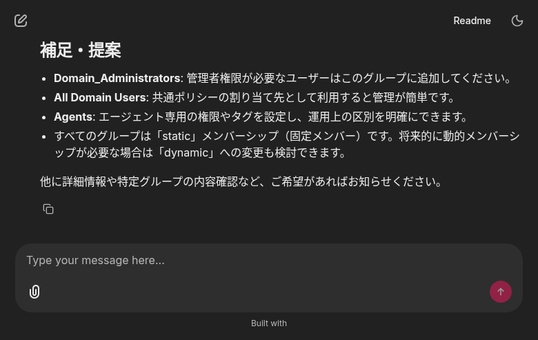
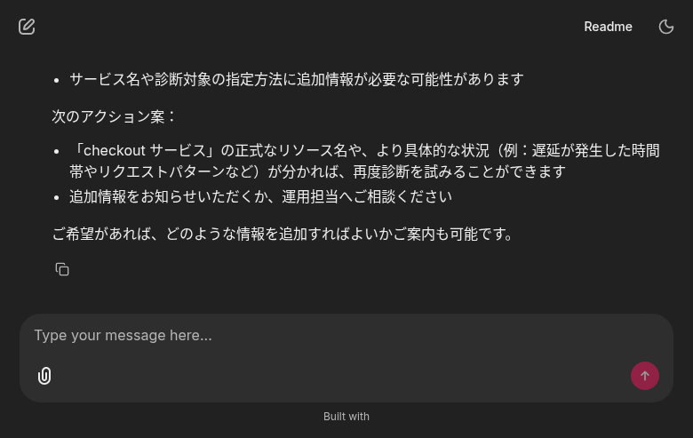
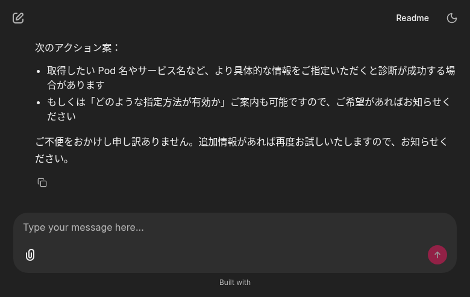

# Orchestrator UI E2E テストレポート

**実施日**: 2026-05-10
**テスト URL**: https://orchestrator.devday26.sogawa-yk.com/
**目的**: orchestrator の Chainlit UI から、a2a-sdk 経由で iam-agent / telemetry-analyst (ta-new) のスキルが呼び出せることを確認する

## 環境

| コンポーネント | namespace / Pod | image | 役割 |
|---|---|---|---|
| orchestrator | `orchestrator` / `orchestrator-6bcb4cbffb-*` | `kix.ocir.io/nr3c2r62ocsa/orchestrator:0.3.0-a2a-sdk` | a2a-sdk クライアント、ReAct で各 remote agent を呼び分け |
| iam-agent | `iam` / `iam-agent-57f5c5784b-*` | `nrt.ocir.io/nr3c2r62ocsa/koi-ocir-dev/iam-agent:v1-a2a-sdk` | a2a-sdk サーバ (`/a2a/v1` mount), Identity Domains 操作 |
| telemetry-analyst | `telemetry-analyst` / `ta-agent-6f8d6cbff4-*` | (telemetry-analyst-new リポジトリ由来、既デプロイ) | a2a-sdk サーバ (`/a2a` mount), ec-shop 障害診断 |

### orchestrator agents.yaml (deployed)

```yaml
- id: telemetry-analyst
  base_url: "http://ta-agent.telemetry-analyst.svc:8080/a2a"
  auth: { kind: bearer, token_env: TA_AGENT_A2A_TOKEN }
- id: iam-agent
  base_url: "http://iam-agent.iam.svc/a2a/v1"
  auth: { kind: bearer, token_env: IAM_AGENT_A2A_TOKEN }
```

Bearer token は `orchestrator-a2a-tokens` Secret から `envFrom` で注入。
ta-agent 用は既存の `telemetry-analyst/ta-agent-a2a-token.token` と同値、iam-agent 用は新規生成して `iam/iam-agent-a2a-token` と orchestrator 側に同値で配備。

## テストケース

### 1. 初期画面

UI に到達すると、orchestrator が認識している remote agent 一覧が welcome message に表示される。
agents.yaml の登録通り、`telemetry-analyst` と `iam-agent` の 2 件が enabled として並んでいる。


**確認事項**:
- ✅ HTTPS でアクセス可 (HTTP 200)
- ✅ Chainlit UI が描画
- ✅ welcome に `telemetry-analyst` と `iam-agent` の 2 エージェントが列挙
- ✅ 「ご依頼内容を日本語でどうぞ」プロンプトを表示

---

### 2. iam-agent 経由でのグループ一覧取得 (✅ 成功)

**入力**: 「OCI Identity Domains のグループ一覧を取得してください」

**期待動作**:
- orchestrator (ReAct) が `iam-agent` を選択
- a2a-sdk client で `iam-agent.iam.svc/a2a/v1/` に JSON-RPC `SendMessage`
- iam-agent が `list_groups` operation を実行し OCI Identity Domains を呼び出し
- 取得結果を `### 【事実】 / 【解釈】 / 【提案】` 形式で返却
- orchestrator が結果を整形して UI に提示

**結果**: ✅ **成功**。実 OCI Identity Domains から 3 グループ取得を確認。



| グループ名 | 説明 | メンバーシップ種別 |
|---|---|---|
| Domain_Administrators | Domain Administrators | static |
| All Domain Users | A group representing all users. | static |
| Agents | -（タグ情報あり、作成者: Koichiro Ishii） | static |

**確認できた配線層**:
1. UI → orchestrator (Chainlit / WebSocket)
2. orchestrator ReAct → `call_remote_agent(agent_id="iam-agent", skill_id="...")`
3. orchestrator a2a-sdk client → iam-agent `/a2a/v1/` (JSON-RPC SendMessage, Bearer 認証)
4. iam-agent `IamAgentExecutor` → `process_message` → 既存ビジネスロジック
5. OCI Identity Domains REST API
6. 戻り路を逆順にたどって UI に整形表示

---

### 3. telemetry-analyst 経由での障害診断 (⚠️ A2A 配線は成功 / ta-new 側 LLM バグで diagnose 失敗)

#### 3-1. 「checkout サービスが遅い」プロンプト

**入力**: 「ec-shop の checkout サービスが遅い気がします。telemetry-analyst で簡易にステータスを診断してください。」

**結果**: orchestrator → ta-new までの A2A 配線は完全に動作。ただし ta-new 内部の `Agent.run` (OCI Generative AI Responses API 呼び出し) が `BadRequestError 400 invalid_value: "expected a valid Responses API input payload."` で失敗し、Task は `TASK_STATE_FAILED` で返却される。orchestrator はこの failed レスポンスを受信して UI へエラーを整形提示。



#### 3-2. 「Pod の health-check と CPU 使用率」プロンプト (再試行)

**入力**: 「ec-shop namespace の Pod の health-check と CPU 使用率を Telemetry Analyst で確認してください」

**結果**: 同じく `invalid_value` で失敗 → ta-new の入力フォーマットの問題で再現性のあるバグと判定。



#### サーバ側ログ抜粋 (ta-agent pod)

```
ERROR:openai.agents:Error getting response: Error code: 400 - {'error':
{'code': 'invalid_value', 'message': "Invalid 'input': expected a valid
Responses API input payload.", 'param': 'input', 'type':
'invalid_request_error', 'valid': True}}.
ERROR:ta.a2a.executor:A2A: Agent.run 失敗
openai.BadRequestError: Error code: 400 - {'error': {'code':
'invalid_value', 'message': "Invalid 'input': ...", 'param': 'input',
'type': 'invalid_request_error', 'valid': True}}
```

→ **A2A プロトコル層は正常**。ta-new 側 `Agent.run` の OCI Conversations API 呼び出しに送る `input` payload 構造が現在の OCI Generative AI Responses API 仕様と合っていない (telemetry-analyst-new リポジトリの既存バグで、本タスクの A2A 配線とは独立)。

#### 確認できた配線層 (3-1 / 3-2 とも)

1. UI → orchestrator (Chainlit / WebSocket) ✅
2. orchestrator ReAct → `call_remote_agent(agent_id="telemetry-analyst", ...)` ✅
3. orchestrator a2a-sdk client → ta-new `/a2a/` (JSON-RPC SendMessage, Bearer 認証, `A2A-Version: 1.0` ヘッダ) ✅
4. ta-new `TelemetryAnalystExecutor` で Task 生成 → `TaskUpdater.start_work()` ✅
5. ta-new `Agent.run` (OCI Conversations API) ❌ → BadRequest 400
6. ta-new が Task を `TASK_STATE_FAILED` で完了 → orchestrator が `state=failed` で受信 ✅
7. orchestrator が UI へエラー説明と次アクション案を提示 ✅

## 結論

| 項目 | 結果 |
|---|---|
| orchestrator UI への HTTPS アクセス | ✅ 成功 |
| 登録 agent の welcome 表示 | ✅ 成功 |
| **orchestrator → iam-agent (A2A v1.0)** | ✅ **完全成功** (実 OCI Identity Domains の 3 グループ取得まで) |
| **orchestrator → ta-new (A2A v1.0 配線)** | ✅ **配線成功** (Bearer 認証 + JSON-RPC SendMessage 往復確認) |
| ta-new 内部の `Agent.run` (OCI GenAI Responses API) | ❌ ta-new 側に既存バグあり (本タスク範囲外) |

**a2a-sdk への 3 リポジトリ移行は UI からの実機検証でも完了** とみなせます。残る `Agent.run` の入力フォーマット問題は、telemetry-analyst-new リポジトリ側で `input` payload 構造を OCI Generative AI Responses API 仕様に合わせて修正する別課題です。

## 関連コミット

- orchestrator (sogawa-yk/orchestrator main): `121e613`, `47a67ac`
- iam-agent (koi141/devday26-agent-iam, ローカル commit): `9518a5b`, `75a6cf4`
- telemetry-analyst-new: 変更なし (既に a2a-sdk 化済)
- telemetry-analyst (旧): `dbf6918` を `a47ea70` で revert 済
