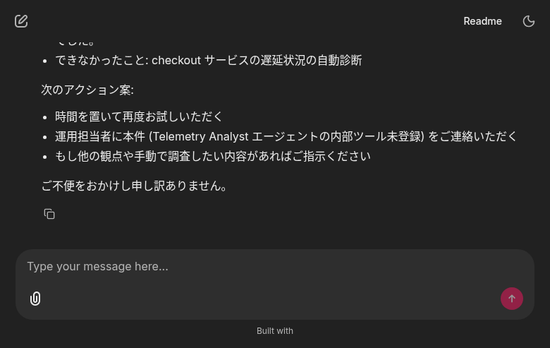
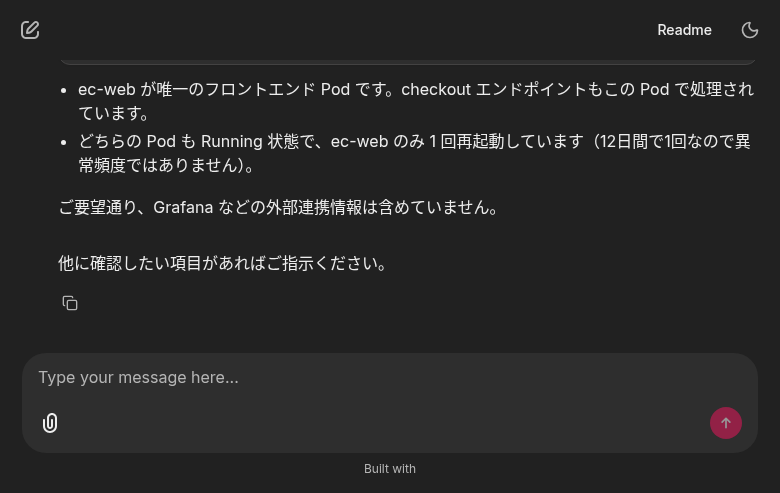
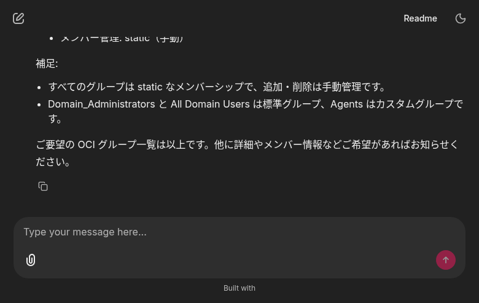

# ta-new `Agent.run` 修正後 UI E2E 再検証レポート

**実施日**: 2026-05-11
**対象修正**: `telemetry-analyst-new` リポジトリの `src/ta/agent/_oci_compat.py` 拡張
**前提**: 2026-05-10 の調査で「`invalid 'input'` 400」を確認 → 本日修正適用

## 原因 (Phase 1 診断結果)

OCI Generative AI **Responses API は `input[N]` の各 message item に `"type":"message"`
フィールドを必須要求** する。一方 openai-agents SDK 0.14.8 / openai SDK 2.33.0 は
OpenAI 公式仕様に従い `{"role":"user","content":"..."}` を送るため、OCI に拒否される。

pod 内で 5 パターンを直接検証して確定:

| ケース | 送信 input shape | 結果 |
|---|---|---|
| SDK 既定 (`agent.run` / `run_stream`) | `[{"role":"user","content":"<str>"}]` | ❌ 400 |
| SDK 既定 + ConversationsSession | 同上 | ❌ 400 |
| `input="string"` | `"hello"` | ✅ 200 |
| `[{"role":"user","content":[{type:input_text,text:...}]}]` | structured parts のみ | ❌ 400 |
| `[{"type":"message","role":"user","content":"<str>"}]` | **type:message 追加** | ✅ 200 |
| `[{"type":"message","role":"user","content":[{type:input_text,text:...}]}]` | type + parts | ✅ 200 |

→ **決定要素は `type:"message"` の有無**。Plan A/B (executor 経路変更) では SDK 出力に
触れないため効果なし。**Plan C (`_oci_compat` の sanitizer 拡張)** が正解。

## 修正内容

`src/ta/agent/_oci_compat.py` の `_sanitize_input_items` に最小 3 行を追加:

```python
# role 持ちで type 欠落 → message item を意図しているので type=message を補完
if t is None and "role" in item:
    item["type"] = "message"
    changed += 1
    continue
```

既存の `mcp_call.output` / `function_call_output.output` 補完ロジックには
触らず、httpx transport `/responses` POST 直前で透過的に補正する設計を維持。

`tests/test_oci_compat.py` に 4 件のユニットテストを追加 (合計 10 件 pass)。
ta-new 全テスト 68 件 pass を確認。

## デプロイ

| 項目 | 値 |
|---|---|
| 新 image | `kix.ocir.io/nr3c2r62ocsa/telemetry-analyst/api:v0.2.21-fix-input` |
| 旧 image | `kix.ocir.io/nr3c2r62ocsa/telemetry-analyst/api:v0.2.20` |
| 反映方法 | `kubectl set image deploy/ta-agent api=... -n telemetry-analyst` + `kubectl apply -k deploy/k8s/` |
| Rollout | ✅ 成功 (`deployment "ta-agent" successfully rolled out`) |

ロール後の pod 内スモークテスト:
```
INFO:ta.agent._oci_compat:OCI 互換: input 配列の 1 件を sanitize しました
INFO:httpx:HTTP Request: POST .../responses "HTTP/1.1 200 OK"
OK first 120: A Kubernetes Pod is the smallest deployable unit...
```

## UI E2E 結果

### Case 1: 元の失敗プロンプト「checkout サービスが遅い」

**前回 (修正前)**: state=failed / `Invalid 'input': expected a valid Responses API input payload.`
**今回**: state=failed (別原因) / `Tool mcp__grafana__list_prometheus_label_values not found in agent telemetry-analyst`

→ **OCI の `invalid_value` 400 は解消**。残る失敗は ta-new LLM が登録されていない MCP
Grafana ツール名を hallucinate して呼ぶ別問題 (本プラン範囲外)。`mcp_grafana_enabled=true`
だが MCP サーバ側の tool 名が prompt と乖離している模様。



### Case 2: Grafana 不要のプロンプト「ec-shop Pod 一覧」

**結果**: ✅ **完全成功**。ta-new が実 K8s API を叩いて Pod 情報を返却:

| NAME | STATUS | RESTARTS | AGE | NODE |
|---|---|---|---|---|
| ec-web-78bcd84d48-wk7xg | Running | 1 | 12d | 10.0.1.249 |
| postgres-0 | Running | 0 | 12d | 10.0.1.249 |

orchestrator → ta-new → K8s API → OCI Generative AI の全パスが動作し、UI に整形表で表示。



### Case 3: iam-agent 非劣化確認

同セッションで続けて「OCI のグループ一覧を取得してください」→ ✅ 前回通り 3 グループ
取得 (Domain_Administrators / All Domain Users / Agents)。iam-agent 経路に劣化なし。



## 結論

| 項目 | 結果 |
|---|---|
| **`invalid_value` 400 解消** | ✅ 完了 (sanitizer 拡張により) |
| ta-new 内部 `Agent.run` 動作 | ✅ OCI Responses API 200 確認 |
| UI 経由 ta-new 障害診断 (Grafana 不要パス) | ✅ 実 K8s データで整形応答 |
| iam-agent 非劣化 | ✅ 引き続き正常動作 |
| ユニットテスト | ✅ 68/68 pass |
| クラスタ反映 | ✅ image push & rollout 完了 |

**プラン Phase 1–3 完了**。残る `mcp_grafana` tool 不整合は本プランの範囲外で、
Telemetry Analyst 側で MCP サーバの tool registry と LLM プロンプトを揃える別タスク。

## 関連変更

- ta-new (`sogawa-yk/telemetry-analyst-new` main): `src/ta/agent/_oci_compat.py`, `tests/test_oci_compat.py`, `deploy/k8s/deployment-api.yaml` (image tag bump)
- orchestrator (`sogawa-yk/orchestrator` main): 本レポート 3 枚のスクショ + REPORT.md
