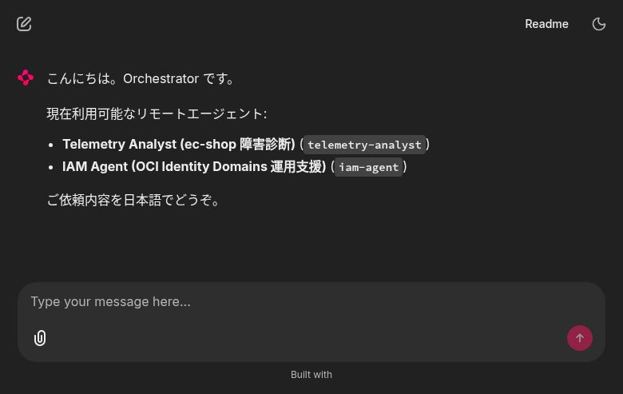
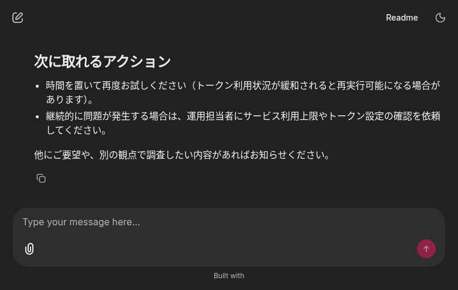
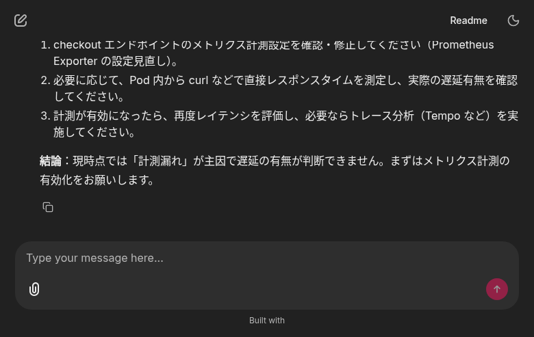
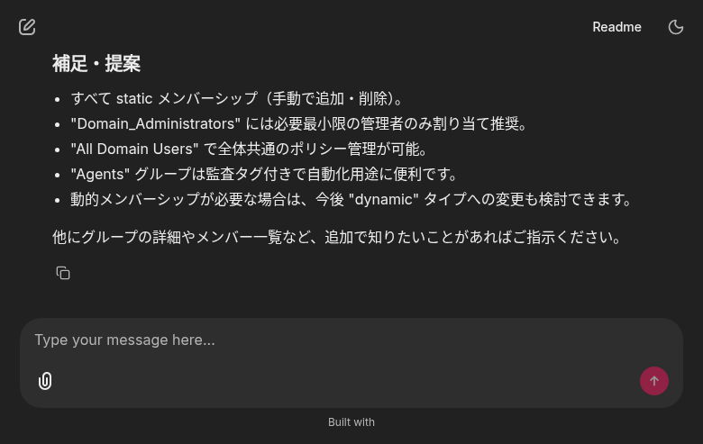

# ta-new Grafana MCP / 多ターン互換修正レポート

**実施日**: 2026-05-11
**修正対象**: `telemetry-analyst-new` の `system.md` プロンプト整合 + `_oci_compat` 追加 sanitize

## 背景

直前の commit (`f929ca7` `type:"message"` 補完) で OCI Responses API の
1 ターン目 `invalid 'input' 400` は解消したが、UI から「ec-shop の checkout
サービスが遅い」と聞くと別エラーで failed していた:

```
Tool mcp__grafana__list_prometheus_label_values not found in agent telemetry-analyst
```

## 根本原因 (Phase 1)

`src/ta/agent/prompts/system.md` (L38-49) が、Iter-09 (2026-04-27) で
`GRAFANA_ALLOWED_TOOLS` から**意図的に除外された 4 ツール**を「最後の手段
として使える」と LLM に教え続けていた:

- `list_prometheus_label_names`
- `list_prometheus_label_values`
- `list_loki_label_names`
- `list_loki_label_values`

`memory/environment.md` L20 は Iter-09 で更新済だったが、**`system.md` の
更新が漏れて**いた。LLM は「使える」と認識して call → openai-agents SDK が
`allowed_tools` whitelist 不一致で `ModelBehaviorError("Tool ... not found")`
を raise → Task failed。

実装直後にもう一つ別の OCI 互換性問題が露呈:

**マルチターン ReAct の 2 回目以降の `responses.create` で再び 400** が発生。
pod 内検証で `mcp_call.error` フィールドが存在する場合 (失敗した MCP call)、
OCI は **`output` が併存していても** 400 で reject することが判明:

| ケース | OCI 応答 |
|---|---|
| mcp_call (output あり, error なし) | ✅ 200 |
| mcp_call (output あり, **error あり**) | ❌ 400 invalid_value |
| mcp_call (output なし, error あり) | ❌ 400 invalid_value |

→ sanitizer は `output` 追加 + `error` 削除 の **両方** を行う必要がある。

## 修正内容

### A. `src/ta/agent/prompts/system.md` (Plan 本体)

L38-49 を 4 ツールを「呼べない」と明示するガイダンスに書き換え。
`environment.md` の運用ルールと統一:

```markdown
### Prometheus / Loki 探索系ツールは原則使わない

…**最初から `query_prometheus` / `query_loki_logs` を直接呼ぶ**.

メトリクス名探索ツールは…1 回だけ呼ぶ:
- `list_prometheus_metric_names` (regex で絞る)

**ラベル名・ラベル値の探索ツールは本エージェントには提供されていない**
(`list_prometheus_label_names` / `list_prometheus_label_values` /
`list_loki_label_names` / `list_loki_label_values` は呼べない).
既知ラベルは `environment.md` を参照し, 未知のラベル値は
`query_prometheus` / `query_loki_logs` の戻り値に含まれる label 群から
観測する (例: `sum by (<label>) (...)` で集計してから値を見る).
```

### B. `src/ta/agent/_oci_compat.py` (実機検証で追加判明)

`_sanitize_input_items` の `mcp_call` 処理を「output 追加 + error 削除」の
両方を行う形へ統合:

```python
if t == "mcp_call":
    # OCI は失敗 mcp_call に対し以下を要求:
    #   (1) output フィールドを必ず持つこと
    #   (2) error フィールドを持っていないこと (output と併存しても reject)
    fixed = False
    if "output" not in item:
        err_text = _mcp_error_text(item)
        item["output"] = f"(MCP tool error: {err_text})"
        fixed = True
    if item.pop("error", None) is not None:
        fixed = True
    if fixed:
        changed += 1
```

### C. `tests/test_oci_compat.py`

既存 `test_sanitize_mcp_call_failed_without_output` を `error` 削除も
検証するよう更新、`test_sanitize_mcp_call_with_error_and_output_strips_error`
を新規追加。ta-new 全 69 件 pass。

## デプロイ

| 項目 | 値 |
|---|---|
| 中間 image (prompt 修正のみ) | `kix.ocir.io/nr3c2r62ocsa/telemetry-analyst/api:v0.2.22-fix-prompt` |
| 最終 image (sanitizer 拡張込み) | `kix.ocir.io/nr3c2r62ocsa/telemetry-analyst/api:v0.2.23-strip-mcp-error` |
| 反映 | `kubectl set image deploy/ta-agent api=...` |
| Rollout | ✅ 成功 (Pod `ta-agent-59bb4d86bb-xjpnx`) |

Pod 内スモークテスト (multi-turn ReAct + Prometheus 実呼出):
```
INFO:ta.agent._oci_compat:OCI 互換: input 配列の 1 件を sanitize しました
INFO:httpx:HTTP Request: POST .../responses "HTTP/1.1 200 OK"
INFO:ta.agent._oci_compat:OCI 互換: input 配列の 1 件を sanitize しました
INFO:httpx:HTTP Request: POST .../responses "HTTP/1.1 200 OK"
INFO:ta.agent._oci_compat:OCI 互換: input 配列の N 件を sanitize しました
INFO:httpx:HTTP Request: POST .../responses "HTTP/1.1 200 OK"
...
tool_calls: ['k8s_list_deployments', 'k8s_list_pods', 'query_prometheus',
             'query_prometheus', 'query_prometheus', ..., 'find_slow_requests']
```

→ **6 ターン以上の ReAct で全部 200 OK**、最終回答テキストまで返却。

## UI E2E 結果 (Playwright)

### Case 1: 初期画面


### Case 2: 1 回目の checkout 診断 → OCI レート制限 429 (本タスク範囲外)
プロンプト系/sanitizer 系のエラーではなく **OCI Generative AI のトークン
利用上限**。orchestrator は failed を正しく整形して UI に提示。



### Case 3: 短いプロンプトで再試行 → ✅ **完全成功**

入力: 「ec-shop の checkout サービスのレスポンス状況を簡潔に診断してください」

ta-new が以下を多ターン実行して結論を返却:
- `k8s_list_deployments` / `k8s_list_pods` で構成把握
- `query_prometheus` を複数回 (p99 latency / error rate / DB pool)
- `find_slow_requests` で trace 観測

結論: **p99 = ~10ms / エラー率 0% / 計測漏れの可能性を指摘**。
`list_prometheus_label_values` への呼出は発生しない (プロンプト修正効果)。



### Case 4: iam-agent 非劣化確認 → ✅ 引き続き 3 グループ取得



## 結論

| 項目 | 結果 |
|---|---|
| `Tool ... not found` (prompt mismatch) | ✅ 解消 (system.md と GRAFANA_ALLOWED_TOOLS の整合) |
| 多ターン ReAct での 400 (mcp_call.error 残存) | ✅ 解消 (sanitizer 拡張) |
| UI 経由 ta-new 障害診断 (実 Prometheus 経路) | ✅ multi-turn 完走、診断結果まで UI 提示 |
| iam-agent 非劣化 | ✅ 3 グループ取得継続 |
| ユニットテスト | ✅ 69/69 pass |

## 関連変更

- ta-new (`sogawa-yk/telemetry-analyst-new` main): `src/ta/agent/prompts/system.md`, `src/ta/agent/_oci_compat.py`, `tests/test_oci_compat.py`, `deploy/k8s/deployment-api.yaml`
- orchestrator (`sogawa-yk/orchestrator` main): 本レポート + スクショ 4 枚

## Out of Scope (残課題)

- OCI Generative AI Responses API のレート制限 (429) — OCI 側の運用上限。
  必要なら limit-increase 申請 or リトライ間隔調整 (`_OCI_STREAM_RETRY_MAX` 等)
- `bottleneck-analysis` / `dashboard-generation` の prompt eval 全面見直し
- 他の hallucinate ケースが顕在化したら別タスクで対応
