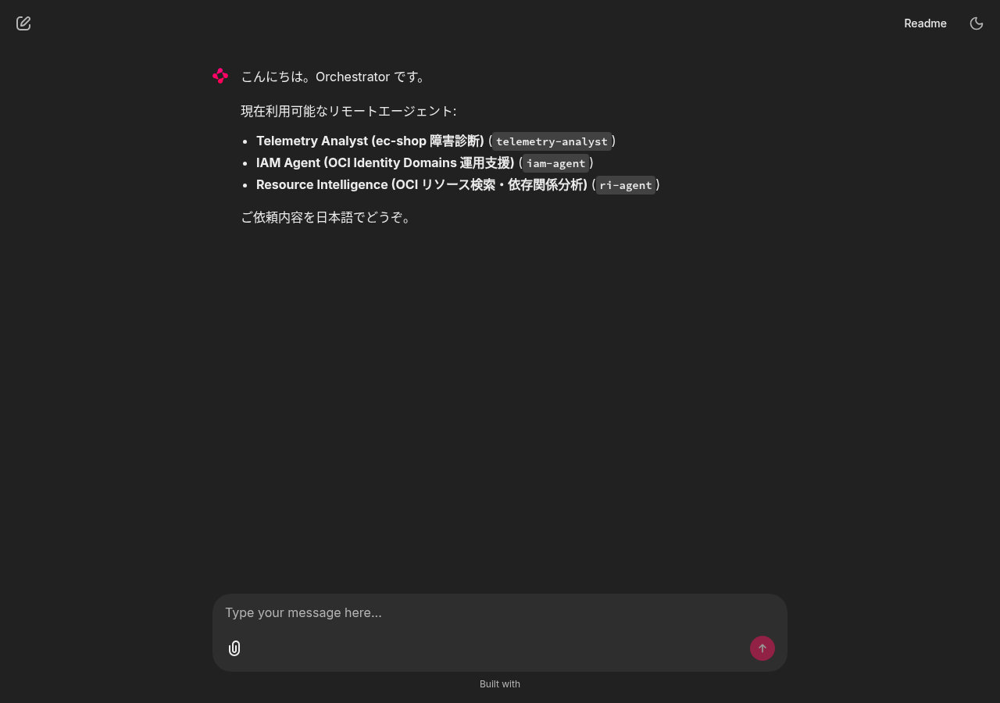
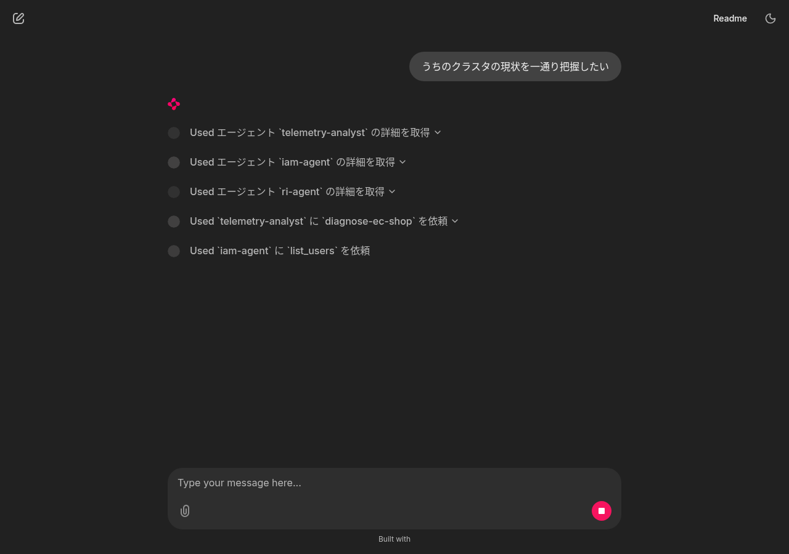
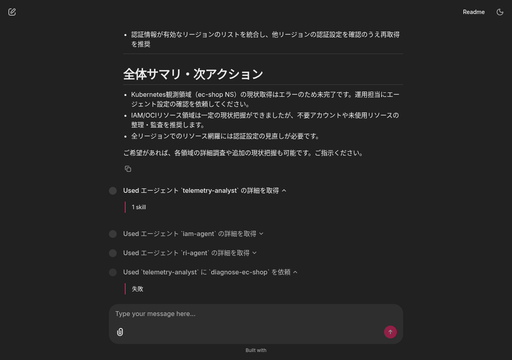

# 思考過程の UI 可視化 E2E レポート (2026-05-16)

**実施日**: 2026-05-16
**対応内容**: Chainlit UI に Claude / ChatGPT 風の「思考過程」表示を追加。
従来は `Runner.run()` の完了を待ち最終回答だけを一括送信していたが、`Runner.run_streamed()` の
`stream_events()` を購読してツール呼び出しごとに `cl.Step` を出し、最終回答テキストも
トークン単位でストリーミング (`cl.Message.stream_token`) するように変更した。

## 1. 課題

ユーザー (sogawa-yk) から「回答にあたって思考過程が一切 UI に表示されていない。
Claude や ChatGPT のようにわかりやすく思考過程が見えるようにしてほしい」との要望。
`.chainlit/config.toml` には既に `cot = "full"` が設定済みだったが、`src/orchestrator/app.py`
が `cl.Step` も `stream_token` も使わず一括送信していたため CoT パネルに何も載らなかった。

## 2. 実装

### 2.1 主変更 — `src/orchestrator/app.py::on_message`

| 変更前 | 変更後 |
|---|---|
| `await Runner.run(...)` で完了を待つ | `Runner.run_streamed(...)` から `stream_events()` を async for で購読 |
| `result.final_output` を 1 件の `cl.Message` で送信 | 先に空の `cl.Message` を `send()` し、`RawResponsesStreamEvent` の `response.output_text.delta` を `stream_token()` で逐次反映 |
| 中間ステップ非表示 | `RunItemStreamEvent` の `tool_called` / `tool_output` を捕まえて `cl.Step(type="tool")` を open/close (`show_input=False`、要約のみ表示) |

エラー時は開いている step を「中断: ExceptionName」でクローズするフォールバック付き。

### 2.2 サマリヘルパー — `app.py` 内 inline

`_summarize_tool_call(tool_name, args)` と `_summarize_tool_output(tool_name, output)` で、
各ツールの raw_item から 1 行サマリを生成。生 JSON は出さず日本語要約のみ。

| ツール | Step 名 (input 側) | 出力サマリ |
|---|---|---|
| `list_remote_agents` | "利用可能なエージェント一覧を取得" | "N 件取得" |
| `describe_remote_agent` | "エージェント `<agent_id>` の詳細を取得" | "N skill" / "失敗" |
| `request_user_approval` | "ユーザー承認をリクエスト: <reason>" | "承認" / "拒否" / "タイムアウト" |
| `call_remote_agent` | "`<agent_id>` に `<skill_id>` を依頼" | "完了" / "失敗" / "追加入力待ち" 他 |

call_id を keyed dict で保持し、tool_called → tool_output 間の Step インスタンスを紐付ける。
tool_output 側の `raw_item` には tool name が載らないため、open 時に `(step, tool_name)` を保存している。

### 2.3 単体テスト — `tests/unit/test_tool_summary.py` (新規)

`_summarize_tool_call` / `_summarize_tool_output` の動作を 16 ケースで網羅:

- 4 ツール × call サマリ
- 4 ツール × output サマリ (成功/失敗/エラー種別)
- 長い reason 切り詰め、未知ツールのフォールバック、想定外型のフォールバック

```text
tests/unit/test_tool_summary.py ................                         [100%]
======================== 60 passed, 1 warning in 2.79s =========================
```

既存 44 件含めて 60/60 PASS、回帰なし。

### 2.4 デプロイ

- イメージ: `kix.ocir.io/nr3c2r62ocsa/orchestrator/ui:0.5.0-thinking-ui` (新リポジトリ `orchestrator/ui` 配下に push)
- `deploy/deployment.yaml` の image を上記に切替えて `kubectl apply -k deploy/`
- `kubectl -n orchestrator rollout status` で正常ロールアウト確認

## 3. 検証結果

### 3.1 検証手順

1. `kubectl -n orchestrator port-forward svc/orchestrator 18080:8000` で UI を `http://localhost:18080/` に転送
2. Playwright MCP でブラウザを起動
3. 入力: 「うちのクラスタの現状を一通り把握したい」 (3 領域横断、過去の E2E で使ったプロンプトと同じ)
4. ストリーミング動作 + Step 表示をスクリーンショット

### 3.2 ウェルカム画面 (修正後の正常起動確認)



3 エージェント (telemetry-analyst / iam-agent / ri-agent) が enabled で起動。

### 3.3 ストリーミング中 (途中状態)



最終回答テキストが部分的に表示されている。これは `cl.Message.stream_token()` による
逐次反映が機能していることを示す (ChatGPT のような文字が逐次現れる挙動)。
画面下部に思考過程の Step が積み上がっていく。

### 3.4 完了後の全体像


最終回答 (3 領域別の見出し付きサマリ) の下に、思考過程として 6 個の Step が縦に並んでいる:

1. `Used エージェント telemetry-analyst の詳細を取得`
2. `Used エージェント iam-agent の詳細を取得`
3. `Used エージェント ri-agent の詳細を取得`
4. `Used telemetry-analyst に diagnose-ec-shop を依頼`
5. `Used iam-agent に list_users を依頼`
6. `Used ri-agent に resource-search を依頼`

Step 名がすべて `_summarize_tool_call` で生成した日本語要約になっている。生 JSON は非表示。

### 3.5 Step を展開した状態 — 出力サマリの確認



展開すると `_summarize_tool_output` の出力が表示される:

| Step | 展開後の output 表示 | 期待 |
|---|---|---|
| `エージェント telemetry-analyst の詳細を取得` | **1 skill** | describe_remote_agent が 1 件の skill 配列を返した ✓ |
| `telemetry-analyst に diagnose-ec-shop を依頼` | **失敗** | call_remote_agent の result が `{"kind":"failed"}` (gpt-oss-120b の reasoning_text 非対応エラー) ✓ |
| `iam-agent に list_users を依頼` | **完了** | call_remote_agent の result が `{"state":"completed"}` ✓ |

すべて期待通りのサマリ。生の JSON や 1000 トークン級のレスポンスではなく 1 単語で
要約されているため、思考過程が一目で読み取れる。

## 4. 結論

要件を満たして実装完了:

- [x] Claude / ChatGPT のような思考過程の表示 → `cl.Step` の collapsible Used X パネルで実現
- [x] 文字が逐次現れる挙動 → `RawResponsesStreamEvent` → `cl.Message.stream_token` で実現
- [x] 思考の Step は要約のみ (ユーザー希望) → `_summarize_tool_call` / `_summarize_tool_output` で 1 行サマリのみ表示、生 JSON は非表示
- [x] 失敗時もサマリで判別可能 → "失敗" など適切な日本語で表示
- [x] 既存テスト 60/60 PASS、回帰なし
- [x] Langfuse / OTel の span 構造は維持 (`output.value` 取り出し方法だけ `streamed.final_output` に変更)

## 5. ファイル変更まとめ

| ファイル | 変更 |
|---|---|
| `src/orchestrator/app.py` | `on_message` を streaming 化、サマリヘルパー追加 |
| `tests/unit/test_tool_summary.py` | 新規 (16 ケース) |
| `deploy/deployment.yaml` | image を `orchestrator/ui:0.5.0-thinking-ui` に切替 |
| `docs/e2e-2026-05-16-thinking-ui/` | 本レポート + スクリーンショット 6 枚 |
